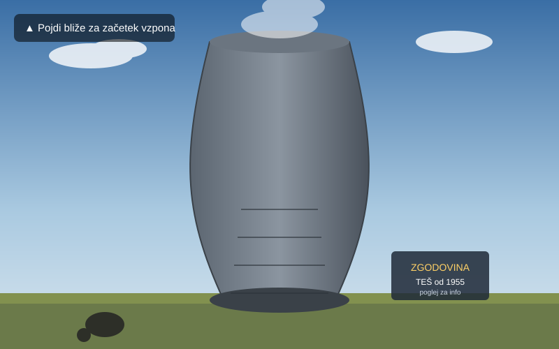
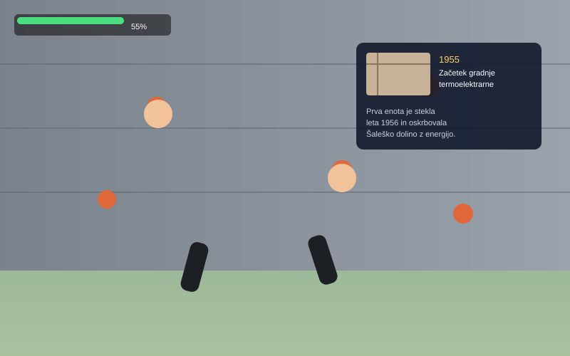
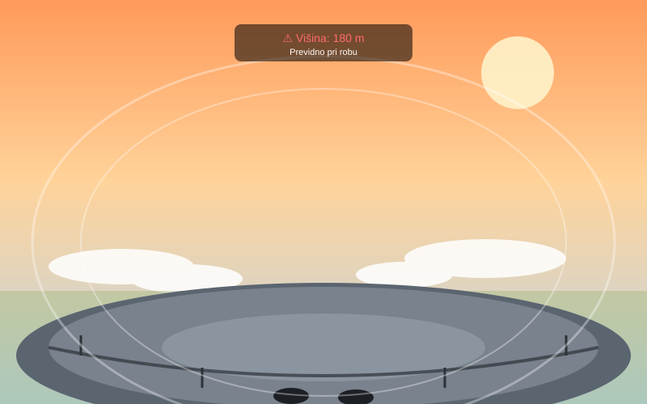

# Vizualizacija scen VR/AR aplikacije

Aplikacija: **Vzpon: Zgodba Šoštanjske elektrarne** (VR)

Spodnje skice prikazujejo tri ključne scene aplikacije iz perspektive uporabnika v VR napravi (Meta Quest). Vizualizacije so izdelane kot mockup skice, ki prikazujejo prostorsko zasnovo, perspektivo in kontekst uporabe.

## Scena 1: Uvodna scena – Vznožje elektrarne

**Opis:**
Uporabnik se znajde ob vznožju hladilnega stolpa Termoelektrarne Šoštanj in gleda navzgor proti vrhu, ki se izgublja v oblakih. Na voljo ima informacijsko tablo, ki na kratko predstavi zgodovino elektrarne. Ko se uporabnik približa konstrukciji, se aktivira namig za začetek plezanja.

- **Kaj uporabnik vidi:** ogromen hladilni stolp/dimnik pred seboj, oprijeme na spodnjem delu konstrukcije, informacijsko tablo ob strani.
- **Kaj uporabnik lahko počne:** se sprehodi po vznožju, si prebere osnovne informacije, s približevanjem konstrukciji sproži začetek plezalne sekvence.
- **Namen scene:** uvod v aplikacijo, vzpostavitev občutka merila (velikosti objekta) in konteksta lokacije, pred začetkom osrednje interakcije.

## Scena 2: Glavna interakcija – Plezanje in zgodovinske točke

**Opis:**
Uporabnik je sredi vzpona po zunanji konstrukciji elektrarne. S kontrolerji prijema oprijeme na steni in se premika navzgor. Ob določenih kontrolnih točkah se pred njim prikaže plavajoča informacijska tabla z arhivsko fotografijo in besedilom o zgodovini gradnje TEŠ (npr. leto 1955 – začetek gradnje).

- **Kaj uporabnik vidi:** steno konstrukcije z oprijemi tik pred seboj, svoji virtualni roki (kontrolerja) med plezanjem, plavajočo zgodovinsko informacijsko tablo, prikaz napredka vzpona (HUD) in dolino v ozadju spodaj.
- **Kaj uporabnik lahko počne:** prijema in se premika med oprijemi (plezalna mehanika), pogleda proti informacijski tabli za podrobnejši prikaz zgodovinske vsebine, spremlja svoj napredek.
- **Namen scene:** osrednja funkcionalnost aplikacije – združuje fizično/gibalno interakcijo (plezanje) z izobraževalno vsebino (zgodovina energetike).

## Scena 3: Zaključek – Vrh elektrarne in razgled

**Opis:**
Uporabnik doseže vrh elektrarne in stopi na ozko krožno ploščad. Pod seboj vidi oblake in meglico nad dolino, kar poudari občutek višine. Vizualni popačitveni učinki (valoviti obrisi) in opozorilo na HUD-u nakazujeta vrtoglavico. Uporabnik lahko prosto hodi po ploščadi in si ogleda 360° razgled na Šaleško dolino.

- **Kaj uporabnik vidi:** krožno ploščad na vrhu, svoje noge tik ob robu, oblake in dolino globoko spodaj, sončni zahod v ozadju, opozorilo o višini.
- **Kaj uporabnik lahko počne:** prosto hodi po ploščadi, se približa robu za intenzivnejši občutek višine, si ogleda panoramski razgled na okolico.
- **Namen scene:** zaključna scena, ki poplača trud vzpona z razgledom in hkrati ponudi jedro doživetja vrtoglavice/izpostavljenosti višini v varnem virtualnem okolju.
